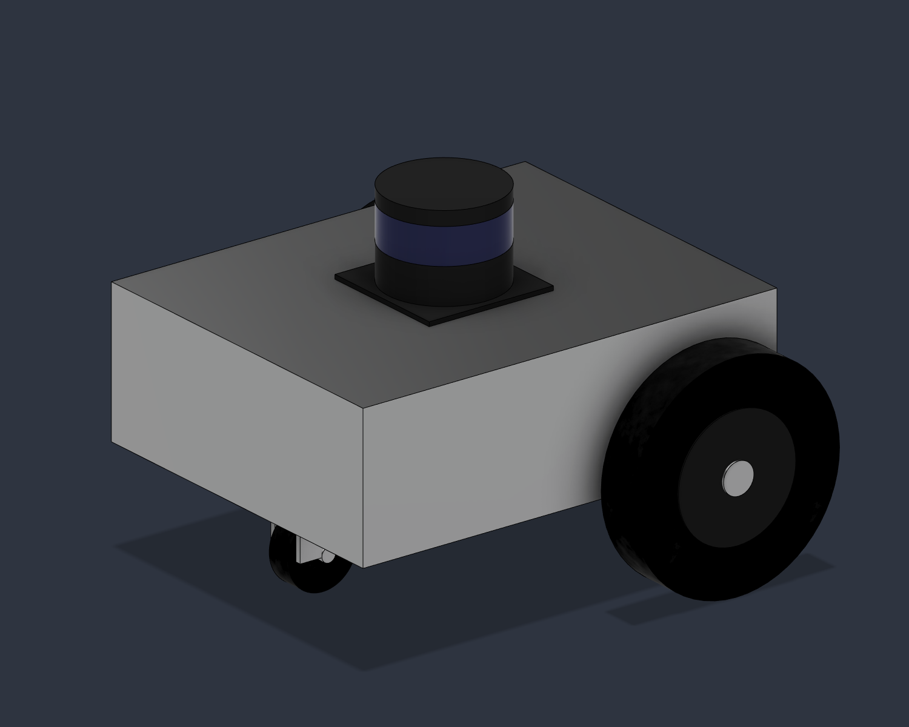

# Differential-drive ROS 2 simulation

A six-link differential-drive robot for Ubuntu 24.04, ROS 2 Jazzy, and
Gazebo Harmonic. The repository includes the Fusion CAD source, STL meshes,
plain URDF description, Gazebo world, ROS–Gazebo bridges, RViz configuration,
and keyboard teleoperation workflow.



## Architecture

```text
Keyboard teleop → /cmd_vel → ros_gz_bridge → Gazebo physics
Gazebo → odometry, joints, LiDAR, clock → ros_gz_bridge → ROS 2
URDF + joint states → robot_state_publisher → TF tree → RViz
```

Gazebo is responsible for physics and sensor simulation. ROS 2 carries
commands, transforms, and sensor data. RViz visualizes the robot, wheel
odometry, TF tree, and laser scan. See [the architecture notes](docs/architecture.md)
for the complete topic and frame layout.

## Repository layout

```text
.
├── cad/
│   ├── Differential Drive Robot.f3d
│   └── cad_geometry_report.json
├── differential_drive_robot_description/
│   ├── meshes/
│   ├── urdf/differential_drive_robot.urdf
│   ├── CMakeLists.txt
│   └── package.xml
├── differential_drive_robot_simulation/
│   ├── config/bridge.yaml
│   ├── config/simulation.rviz
│   ├── launch/sim.launch.py
│   ├── worlds/test_world.sdf
│   ├── CMakeLists.txt
│   └── package.xml
└── docs/
    ├── architecture.md
    ├── verification.md
    ├── images/
    └── reports/
```

The CAD model is the editable design source. The URDF and STL files are a
simulation snapshot and are not updated automatically when the CAD changes.

## Prerequisites

Install Ubuntu 24.04, ROS 2 Jazzy, and the ROS integration for Gazebo
Harmonic. Do not install Gazebo Classic for this project.

```bash
sudo apt update
sudo apt install \
  ros-jazzy-ros-gz \
  ros-jazzy-robot-state-publisher \
  ros-jazzy-teleop-twist-keyboard \
  ros-jazzy-rviz2 \
  python3-colcon-common-extensions \
  python3-rosdep \
  liburdfdom-tools
```

## Workspace setup

Clone this repository beneath the workspace's `src` directory:

```bash
mkdir -p ~/ros2_ws/src
cd ~/ros2_ws/src
git clone <repository-url> differential-drive-robot

cd ~/ros2_ws
source /opt/ros/jazzy/setup.bash

rosdep install \
  --from-paths src/differential-drive-robot \
  --ignore-src \
  --rosdistro jazzy \
  -r -y

colcon build --symlink-install \
  --packages-select \
  differential_drive_robot_description \
  differential_drive_robot_simulation

source install/setup.bash
```

Only the two robot packages are selected, so unrelated packages in the same
workspace are not built.

## Run the simulation

Start Gazebo, the robot state publisher, ROS–Gazebo bridges, robot spawning,
and RViz:

```bash
source /opt/ros/jazzy/setup.bash
source ~/ros2_ws/install/setup.bash
ros2 launch differential_drive_robot_simulation sim.launch.py
```

In a second terminal, start keyboard control:

```bash
source /opt/ros/jazzy/setup.bash
source ~/ros2_ws/install/setup.bash
ros2 run teleop_twist_keyboard teleop_twist_keyboard
```

The useful differential-drive keys are:

```text
u    i    o      forward-left / forward / forward-right
j    k    l      rotate-left / stop / rotate-right
m    ,    .      reverse-left / reverse / reverse-right
```

Press `k` or Space to send a zero-velocity command before terminating teleop.
The speed controls printed by the teleop program can be used, but Gazebo caps
the robot at 0.5 m/s linear and 1.5 rad/s angular velocity.

## Verification

The description should convert to six links, five joints, sixteen mesh URIs,
two model plugins, and one GPU LiDAR sensor. Runtime expectations are about
50 Hz for `/odom` and `/joint_states`, and 10 Hz for `/scan`.

Use the commands and acceptance checklist in
[docs/verification.md](docs/verification.md).

## Known behavior

`/odom` is wheel odometry. If the robot pushes against an obstacle while the
wheels continue turning, RViz can show motion even though the physical model
is blocked in Gazebo. This is expected wheel-slip drift. The red obstacle
shape in RViz is the LiDAR scan, not the Gazebo world model.

## CAD and reports

The Fusion archive is stored in `cad/Differential Drive Robot.f3d`. Existing
geometry, mass-property, and validation reports are retained alongside the
repository documentation. CAD source and report data should be revalidated
after changing dimensions, component placement, joint origins, or mesh
exports.

## License

The repository currently remains proprietary; see [LICENSE](LICENSE). Choose
and apply an open-source hardware/software license before inviting reuse or
redistribution. Update the `<license>` and maintainer entries in both
`package.xml` files if the licensing or ownership information changes.
